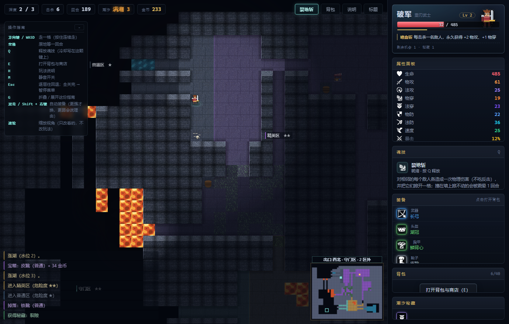
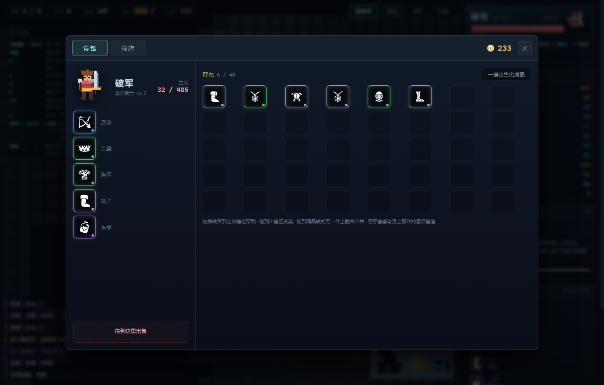
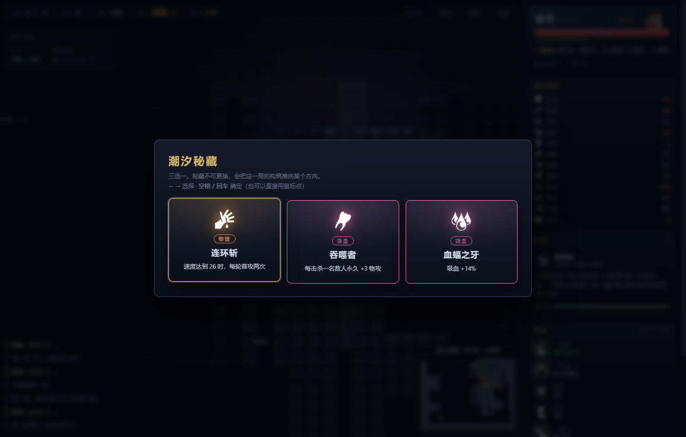
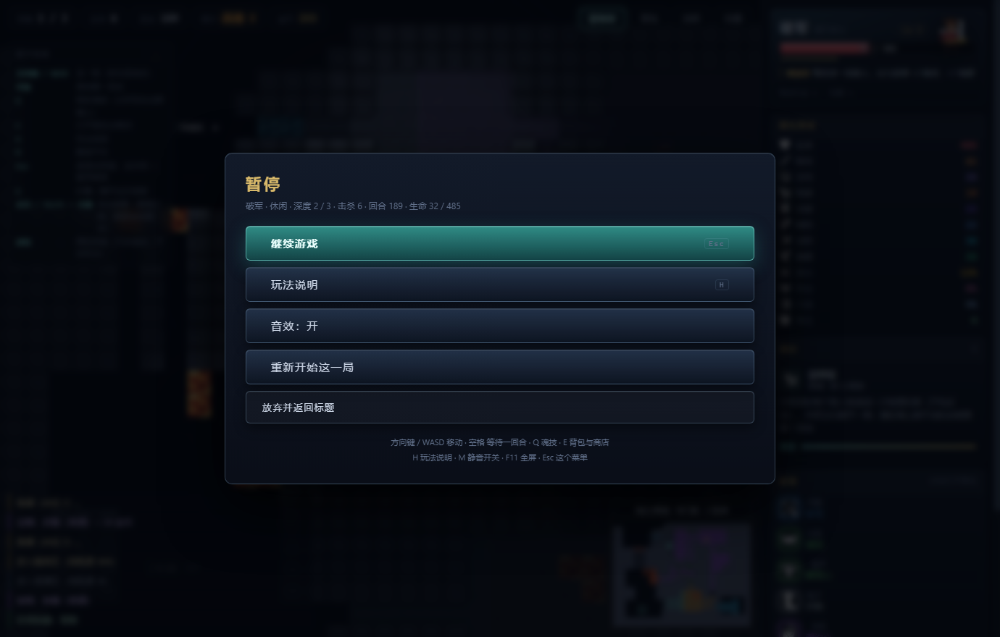

# 数值潮汐 · Numeral Tide

> 一个「一个文件夹拷走、双击就玩」的单机**属性构筑 roguelike**。
>
> 走进敌人格就开战。伤害按 `攻击 × 50 / (有效防御 + 50)` 结算 ——
> **物防高的用魔法打，法防高的用物理打**。
> 但每一场战斗都会掉血，而回血极少。
> **你打得赢，不代表你打得值。**
>
> 潮水每 12 回合涨落一次。涨潮时水面扩散、踩水掉血，逼你往前走；
> 退潮时是绕路、开宝箱、找泉水的窗口。

| | |
|---|---|
| 形态 | 绿色免安装，整个文件夹拷走即可运行，可直接传网盘分发 |
| 启动 | 双击 `数值潮汐.exe` —— 自己的游戏窗口，自己的图标和标题 |
| 依赖 | 零安装。渲染内核用 Windows 自带的 WebView2 运行时 |
| 素材 | **零外部素材文件**。地形/角色/怪物由代码实时绘制，图标内联为 SVG |
| 成本 | **0 元**。不调用任何付费服务，可完全离线 |
| 体积 | 约 **1.23 MB**（其中 1.15 MB 是 WebView2 的三个 DLL） |

---

## 先看一眼

上面那些话都不如直接看一眼。下面每张都是**发行版实际运行时**的截图，窗口尺寸就是
exe 的客户区 **1380×880**；由 `tools\shot.ps1` 驱动 `tools\probe_shot.html` 把游戏
自动跑到指定局面再截，同一条命令随时可以重来（见「开发与验证」）。

**局内地牢。** 左侧那块操作指南会跟着当前界面换内容（走路 / 背包 / 选秘藏各一套）；
小地图按区域上色，上方常驻一行出口导航。


| 标题页 · 选职业与难度 | 背包与装备 · 五槽五档 |
|---|---|
|  |  |

| 潮汐秘藏 · 每 6 次击杀给一次三选一 | 暂停菜单 · Esc 逐层往回退 |
|---|---|
|  |  |

---

## 一、三个版本的演进：从「比大小」到「属性对抗」到「潮汐地牢」

**v1 · 数值吞噬。** 你有一个数字，吃掉比自己小的就变大，碰上大的就死。
它跑得通，也验证过平衡，但有一个致命问题：

> "比大小"本质上就是大鱼吃小鱼。一次遭遇的全部信息就是两个数字，
> 所以"打不打、打谁"必然退化成排序问题 —— 最优解是贪心，没有决策。

**v2 · 属性对抗。** 换掉骨架，从比一个数字变成比两个属性面板，并加入偏科敌人。

**v3（当前）· 潮汐地牢。** 在属性对抗之上补齐三件事：
一张 **45×35 的洞窟地图**、一个真正会对你有威胁的**潮汐计时器**、
以及让每一局都不同的**装备构筑**。

---

## 二、战斗模型

```
伤害 = 攻击 × 50 / (有效防御 + 50)
有效防御 = max(0, 防御 − 对方穿透)
```

K=50 时：防御 50 减免一半，防御 100 减免 2/3，防御 200 减免 80% —— 递减且永不免疫。

**攻击方式由系统自动择优**（比较物理/法术两路的实际伤害，取更高的那边）。
针对性因此体现在伤害数字上，而不需要玩家手动切换。

一场对决是**一次算完的**（不是一刀一刀点）。这样"速度"才有意义：
速度领先 18 点可以在这场对决里多打一次。
回合上限 40 轮 —— 超过就按剩余生命比例判定胜负，不会出现"谁都打不死谁"的死局。

### 让公式真正产生决策的，是敌人的偏科

| 敌人 | 物防 | 法防 | 意味着 |
|---|---|---|---|
| 石甲兽 | 26 | **0** | 法术几乎是它的两倍伤害 |
| 幽魂 | **0** | 28 | 必须用物理 |
| 疾风兽 | 3 | 3 | 速度 26，每轮多打你一次 |
| 孢子母 | 8 | 12 | 每 3 回合孵化一只黏液怪，拖久了会被围死 |
| 祷者 | 10 | 20 | 吸血 25%，硬拼会僵持 |
| 巨兽 | 15 | 11 | 血厚打得疼，但跑得慢 |
| 镜影 | 19 | 19 | 没有弱点，只能硬碰 |
| 宝箱怪 | 22 | 4 | 伪装成宝箱，杀它必掉好装备 |

**而真正让这一切成立的，是这一条：HP 是唯一的稀缺资源。**

---

## 三、潮汐：压力来自"窗口在关闭"，而不是"血条在漏"

水位按 `0 → 1 → 2 → 3 → 3 → 2 → 1 → 0` 循环（一个完整周期 = 7 个节拍）。

- **涨潮**：水面从水洼按步数扩散开，通路变窄；站在水里每回合掉血
- **满潮**：地图大部分变成浅滩，只有高地和走廊还能走
- **退潮**：水面退回原位，是你绕路、开宝箱、找泉水的窗口

水面 = 「从水洼出发、步数 ≤ 当前水位」的所有地板格，每次都从**基准地形快照**重算，
所以退潮能真正退回去。

> 第一版是"水位只涨不跌 + 到顶后不断长出新水域"。模拟直接崩了：
> 60 局里 27 局死于潮水、15 局因为全图被淹而卡死。
> 问题不在难度，在于**没有节奏** —— 单向的水位变成了一台死亡时钟，
> 玩家既没有喘息窗口，也没有"趁退潮去探险"的决策。

---

## 四、四个职业

每个职业给一组**有方向**的初始面板 + 一条改变约束的被动。
外观由**参数化纸娃娃**绘制，武器与职业在数据结构上就绑定了，不可能配错。

| 职业 | 武器 | 定位 | 被动 | 魂技（主动） | 招牌机制 |
|---|---|---|---|---|---|
| **破军** | 巨剑 | 物攻流 · 越杀越强 | 每击杀一名敌人，永久 +2 物攻、+1 物穿 | **裂地斩** | 相邻敌人各挨一下且**不吃反击**，然后把它们**掀开一格**；掀不动的撞在墙上被**震晕 1 回合** |
| **秘仪** | 法杖 | 法伤流 · 击杀回血 | 用法术击杀时回复 10% 最大生命 | **潮语洪流** | 视野内最近 3 个敌人各挨一次法术伤害，并让它们**潮湿 2 回合**：期间受到的法术伤害 **+25%** |
| **疾风** | 长弓 | 速度流 · 抢先手 | 每场战斗第一轮必定先攻，且该轮伤害 +40% | **疾影** | **2 次免费行动**（不推进潮汐、敌人不动），且期间你的攻击 **+35%** |
| **铁壁** | 锤盾 | 坦克流 · 残血更硬 | 生命低于 50% 时双防 +60%；战后回复 8% | **不退之壁** | 3 回合双防 **×2.5**、**反弹 50%** 受到的伤害，并立刻回 22% 生命 |

### 为什么每个技能都要有一个"只属于它"的机制

第一版四个技能都只是"造成一次伤害"，玩家反馈「技能没有任何感觉，虽然有效」。
补完表现层之后还有一层更根本的问题：**四个技能之间没有区别**。
所以每个技能都配了一个**能改变打法**的招牌机制：

| 技能 | 机制 | 它改变了什么决策 |
|---|---|---|
| 裂地斩 | 掀开 + 震晕 | 从"能不能反打"变成"要不要用它把敌人从你身边剥下来"；窄走廊里会变成震晕 |
| 潮语洪流 | 潮湿（法术易伤） | 让"先洪流再打"成为一套连段，而不只是一发伤害 |
| 疾影 | 免费行动 + 爆发窗口 | 从"多走两步"变成"这两步要不要用来打一波爆发" |
| 不退之壁 | 反伤 50% | 让坦克在"被围住"时反而变强，而不是只能挨打 |

两个实现上的要点，都写进了注释：

- **眩晕不能在回合开始处递减**，否则它会在敌人行动之前就归零，等于白放 ——
  必须在"敌人该行动的那一刻"消费掉。
- **反伤与增伤都走 `flags()` 这一个汇总口**（临时增益也往里面交），
  于是战斗结算完全不必知道"这个反伤是遗物给的还是技能给的"。

## 四之二、魂技：把「时机」做成一个按钮（设计取自《元气骑士》）

《元气骑士》里最提气的一环是**每个角色有一个自己的技能**。它和普攻是两种东西：
普攻负责"一直有输出"，技能负责**在正确的时机换一个局面**。
所以四个技能都不做纯数值加成，各自换掉一种压力：

| 技能 | 换掉的是 | 为什么不做成数值加成 |
|---|---|---|
| 裂地斩 | 被贴身时的走位压力 | 数值加成只是"伤害更高"，而"不吃反击"改变的是**你敢不敢站进去** |
| 潮语洪流 | 距离压力 | 隔着半个房间先手削一刀，才能主动选择战场 |
| 疾影 | 回合压力 | 额外行动是这一回合里最稀缺的资源 |
| 不退之壁 | 血量压力 | 残血时能硬顶三回合，等于给"要不要撤退"加了个新选项 |

工程上最要紧的一条：**规则只写在模型层**（`core.useSkill`），
HUD 按钮、快捷键 `Q`、模拟器 AI 全都调它。把"能不能放"写进界面是踩过的坑 ——
模拟器的 AI 会绕过规则，于是平衡数据是假的。
冷却按回合结算，**空放（范围内没目标）不消耗冷却** —— 玩家不该因为点空一次被白罚十几回合。

### 技能必须"有感觉"：四层反馈，缺一层都会觉得缺

只把数值做对是不够的。玩家反馈过「技能没有任何感觉，虽然有效」，
量出来发现那时放一次技能只产生了**震屏**，粒子 0、飘字 0 ——
画面上除了抖一下什么都没有。补齐的是这四层：

| 层 | 内容 | 为什么不能省 |
|---|---|---|
| 音 | 四个技能各一个音色（地裂闷响 / 水声 / 破空 / 钟鸣） | 听觉比视觉更容易被记住 |
| 动作 | 身体上浮 + 地面法阵 + 身上一层光 | 这个动作属于**玩家自己**，确认感最强 |
| 特效 | 每个技能一个**招牌形状** | 见下 |
| 界面 | HUD 技能键脉冲一下 | "你按的那一下被收到了" |

**招牌形状**是移植《元气骑士》技能时最容易漏的一点：
四个技能如果都只放一圈通用粒子，玩家记忆里只会留下"放了技能"，
而不是"放了裂地斩"。形状是最好记的语言：

- **裂地斩** → 贴着地面的冲击环（地裂）
- **潮语洪流** → 打出去的能量束（水束）
- **疾影** → 身后的残影拖尾
- **不退之壁** → 包住人的护盾罩，而且只要增益还在就**一直亮着**

最后一条尤其重要：持续型增益必须一直看得见。技能价值的一半是
"我知道它还在生效" —— 只闪一下的护盾，玩家会怀疑自己是不是白点了。

这些都有断言兜着（直接断言数量）：`ok 裂地斩有感觉：74 粒子 / 2 冲击环 / 9 条飘字 / 施法姿态已触发`。

---

## 五、装备与掉落

**五个槽位**：武器 / 头盔 / 胸甲 / 靴子 / 饰品，共 22 种基底。
基底有**固有属性**和明确偏向 —— 看到板甲就该知道它换不来速度。

**五档品质**，词条数分别为 0 / 1 / 2 / 3 / 4：

| 品质 | 词条 | 基础权重 | 数值系数 |
|---|---|---|---|
| 普通 | 0 | 100 | ×1.00 |
| 精良 | 1 | 46 | ×1.18 |
| 稀有 | 2 | 17 | ×1.42 |
| 史诗 | 3 | 5 | ×1.72 |
| 传说 | 4 | 1.2 | ×2.15 |

### 装备融合（设计取自《元气骑士》的武器融合）

把背包里一件**拖到同品质的另一件**上 → 合成一件**高一档**的装备，走"材料 + 金币"的路子。
这是《元气骑士》里最让人上瘾的一环：垃圾不是直接卖掉，而是**留两件凑一对**，
于是"要不要为了一对史诗再多打两层"变成了一个新决策。

定价有两条硬约束，缺一不可（`LOOT.fuseRate`）：

1. **必须 ≥ 结果的售价** —— 否则「融合→出售」就是净赚回路；
2. **必须和商店价可比** —— 定成 0.40 时一件传说只要 58 金币，而商店卖同款要 256，
   于是融合变成"无脑变强"的按钮。实测 0.40 时标准难度通关率从 60.5% 飙到 **79%**、
   掉落里的史诗/传说数量翻了四倍。现在 0.90：仍然比商店便宜（毕竟材料得自己出），
   但不是免费午餐。

冒烟测试里有 6 条盯着它，包括「随机 60 组融合费均 ≥ 产物售价」的反套利扫描，
以及「AI 会不会真的去融合」—— 新机制如果不进模拟器，它在平衡数据里就等于不存在。

**12 条数值词条 + 9 条机制词条**。机制词条才是构筑点：

- `荆棘` 受到攻击时反弹 20% 伤害
- `回响` 法术伤害 22% 概率翻倍
- `处决` 目标生命低于 32% 时伤害 +15%→斩杀
- `血契` 残血时吸血效果 +50%
- `连击` 速度达到 26 时每轮攻击两次
- `吞噬` 每击杀一名敌人物理攻击 +2

**掉率**：普通怪 34%、精英 +32%、宝箱怪必掉、首领必掉且取两件里更好的一件。
深度同时抬高**品质权重**和**词条数值**。

背包里悬停任何一件装备，气泡会直接给出**和身上那件的逐项差值** ——
掉落装备的意义全在于此，让玩家自己心算是不合理的。

---

## 六、潮汐秘藏（局内构筑）

每击杀 **6** 个敌人弹一次三选一，共 18 件，一局大约能拿 7–10 件。
秘藏不可更换、不进背包，机制比装备词条更极端。

> 硬原则：**每一件都必须改变某个约束边界，而不只是加数值。**
> 「物理攻击 +6」是填充物；「速度达到 26 时每轮普攻两次」才是构筑点。

---

## 六之二、潮汐结晶：局外成长（v10.7）

每一局结束都会按「深度 ×12 + 击杀 ×2 + 通关加成」结算成**潮汐结晶**，
回到标题页可以兑换 8 项永久增益：

| 解锁 | 效果 | 结晶 |
|---|---|---|
| 行囊 | 开局 +120 金币 | 60 |
| 鼓胀的行囊 | 开局再 +180 金币 | 150 |
| 补给袋 / 补给箱 | 背包 +4 / 再 +4 格 | 90 / 190 |
| 祖传遗物 / 潮汐馈赠 | 开局带一件精良 / 稀有装备 | 130 / 300 |
| 一线生机 | 每局多一次复活 | 240 |
| 潮汐体魄 | 生命上限 +8% | 170 |

**为什么它不会毁掉平衡标定**：本作唯一的验收标准是模拟器跑出来的通关率。
元进度如果默认生效，通关率就不再是「这个版本的难度」，而变成「我解锁了多少」——
而且是**无声作废**（没人会收到报错，只会觉得"这版好像简单了"）。所以切成三层：

| 层 | 位置 | 职责 |
|---|---|---|
| 数据层 | `data.js` 的 `META` | 解锁表 + 加成折算（**纯函数，零存储依赖**） |
| 存档层 | `meta.js` | localStorage 读写、购买、结算 |
| 模型层 | `core.js` | **只在显式传入 `opts.meta` 时才应用** |

模拟器从不传 → 天然拿不到元进度。冒烟里有一条硬断言盯着这条不变量
（「元进度不泄漏」）。加完这一整套之后重跑 200 局 ×3 档，通关率**逐位未变**
（90% / 64.5% / 39.5%，连击杀数都一样）—— 逐位相同比"差不多"强得多。

存档是**不可信输入**（单机游戏里手改存档本来就是玩法的一部分）：
`sanitize()` 会把负数、越界、类型错误就地修好，并且让**已购集合对前置封闭** ——
否则手改一个 `{gift:1}` 就能白拿稀有开局装备，绕开整条付费链。

结算是**幂等**的：标记打在这一局的 `game` 对象上，同一局重复结算不会让结晶翻倍
（元进度翻倍是不可逆的，玩家可能已经花掉了）。

## 六之三、背景音乐（v10.7）

同样是 Web Audio 实时合成，**零音频文件**。三段强度随潮汐水位与血量切换：

| 段落 | 触发 | 速度 |
|---|---|---|
| 静谧 | 标题页 | 72 |
| 探索 | 局内 | 92 |
| 危机 | 水位 ≥2 或血量 <35% | 108 |

用**氛围**而不是提示条来表达紧张度：提示条服务于事件（会消失），
氛围服务于状态（一直在，玩家不看也知道情况不对）。

两件比"好不好听"更要紧的事：

1. **不用 `setInterval` 直接发声。** 定时器精度只有 ~15ms，后台标签页还会被节流到 1s，
   直接发声会一顿一顿。用的是标准的**提前排程**：定时器每 25ms 醒一次，
   把未来 0.25 秒内该响的音符按**绝对时间**交给音频时钟，由音频线程精确执行。
   主线程再卡也不走音。
2. **不发声时不能还在算。** 静音 / 失焦 → 直接**停掉定时器**，而不是把 master 增益拧到 0。
   增益为 0 时振荡器仍在跑，笔记本风扇会告诉你这件事。

音阶选 **A 小调五声**（没有小二度，程序怎么排列都不会难听），
琶音走势**写死而不是随机** —— 随机每次都不一样，听起来像"没写完"，
而且改动之后没法判断到底是变好了还是变坏了。

## 七、操作

| 操作 | 键位 |
|---|---|
| 移动一格（基底） | 方向键 / `WASD` / 点击相邻格 |
| 连续移动 | **按住**方向键或鼠标不放，松手即停 |
| 自动寻路 | 点击远处（青色小点是路线） |
| 原地等待 | `空格` |
| **魂技** | **`Q`**（或点右上角的技能键） |
| **暂停菜单** | **`Esc`**（逐层往回退，全关完了才弹菜单） |
| 融合装备 | 在背包里把一件**拖到同品质的另一件**上（松手前气泡会写清结果与花费） |
| 背包 / 商店 | `E`（`I` / `B` 同效），`Esc` 关闭 |
| 玩法说明 | `H` |
| 静音 | `M` |
| 全屏 | `F11`（窗口版） |

鼠标移到敌人身上会直接告诉你：**该用哪一路、几轮能杀掉、这场大概要掉多少血。**

---

## 八、背包 · 拖拽 · 商店 · 金币

背包做成**独立整屏界面**（参考《我的世界》），不是侧栏里挤几个小格子：

- 左侧是角色立绘 + 5 个装备槽，右侧是 **40 格**网格
- **拖拽**穿戴：拖到槽位穿、拖到出售区卖、拖到别的格子只是整理顺序
- 悬停显示**和身上那件的逐项差值**，以及身价 / 可卖价格
- 「一键出售劣质品」卖掉所有不如当前装备的

**金币**来自击杀、宝箱和出售。**潮汐商栈**每层 2 处（地图上是金色摊位，
小地图上也是金色），走上去自动打开商店：

- 5 件装备 + 1 次「潮汐圣水」治疗
- 花金币**刷新货架**，每下一层整体换新
- 售价 = 身价 × 35%，商店定价 = 身价 × 175%

> 买价恒高于卖价的约束由单一公式派生，并且在冒烟测试里做了
> **60 件随机装备的套利扫描** —— 否则"买回来再卖出去"就能无限刷钱。

---

## 九、动作与帧率

第一版的手感问题不在帧率，在**移动是瞬移**：逻辑格子坐标直接当屏幕坐标用，
每走一步角色都是"跳"过去的。同时 `blitPX` 每帧对每个精灵**逐像素 `fillRect`**
（一个 24×28 精灵最多 672 次调用，场上十五个实体就是上万次/帧）。

两条都改了：

| 问题 | 做法 |
|---|---|
| 瞬移感 | 逻辑位置（整数格）与**视觉位置（浮点）**分离，每帧指数收敛（与帧率无关） |
| 相机生硬 | 相机单独用更大的时间常数平滑跟随，并且取整（像素画游戏取整才不会让砖缝闪） |
| 没有动作 | 三朝向 × 两帧行走 + 攻击前倾 + 怪物呼吸挤压 + 受击回弹 + 脚下涟漪 |
| 精灵逐像素画 | 全部预烤成离屏 canvas，运行时只 `drawImage` |
| 每帧重画整张世界 | 地形 + AO + 记忆压暗**烘焙**进一张与世界等大的画布，只在状态变化时重建 |
| 小地图每帧重画 | 只在玩家移动时重建 |
| 界面 15fps 轮询重建 DOM | 改为**动作驱动**（回合制游戏的状态只在动作后变化） |

结果：精灵绘制从"每帧上万次 `fillRect`"降到**每个实体一次 `drawImage`**。

---

## 十、三档难度（实测数据）

每档 **300 局**贪心 AI 的实测结果（同一份 `core.js`，无 Python 复刻）。
v11.0 在区域化之后重新标定过一次：

| 难度 | 通关率 | 平均回合 | 平均击杀 | 定位 |
|---|---|---|---|---|
| 休闲 | **85.0%** | 421 | 31.5 | 熟悉属性玩法 |
| **标准** | **56.7%** | 420 | 37.6 | 主推体验 |
| 深渊 | **40.3%** | 424 | 67.2 | 敌人成长快、精英成群 |

> 区域化让三档都略微变难（精英区 +25%、危险区 +15%、守门区 +10% 的属性），
> 但它同时给了玩家"绕开"这个选项 —— 而**模拟器 AI 不会绕路**。
> 所以这些数字是通关率的**下限**：真人会更高。
>
> 贪心 AI 从不犯错、也不会犹豫，所以**人类玩家的真实通关率会明显低于这些数字**。
> 这一版的 AI 会逛商店、会放魂技、也会融合装备 —— 所以经济、技能、融合三条线
> 都被一起验证了（有测试专门断言"AI 会不会用"，否则新机制在数据里等于不存在）。

### 一个反直觉的结论：敌人强度不是难度旋钮

加完魂技和融合，标准难度一度从 60.5% 涨到 79%。第一反应是"敌人太弱"，于是扫 `enemyMul`：

| enemyMul | 1.00 | 1.25 | 1.50 | 1.75 |
|---|---|---|---|---|
| 通关率 | 82.5% | 74.2% | 80.8% | 78.3% |
| 平均回合 | 352 | 356 | 400 | 402 |
| 平均击杀 | 74 | 89 | 120 | 136 |

**基本持平。** 因为这是个正反馈循环：

```
敌人更强 → 击杀更多 → 升级更快 + 掉落更多 → 玩家同步变强 → 通关率不变
```

它改变的是**节奏**（回合 352→402），不是**难度**。
真正的旋钮是**战后回血** —— 它直接决定"HP 还算不算稀缺资源"：

| 难度 | 原值 | 定稿 | 依据 |
|---|---|---|---|
| 休闲 | 0.080 → 97% | **0.040 → 87%** | 0.06→93%、0.02→82% |
| 标准 | 0.070 → 82.5% | **0.040 → 61.5%** | 0.045→65.8%、0.02→45%、0→28.3% |
| 深渊 | 0.045 → 61% | **0.028 → 39%** | 0.03→40%、0.015→23%、0→13% |

**验收标准是零卡死。** 当前 600 局里 `stall = 0`、`timeout = 0`，
失败只剩一种：`dead`。

---

## 十一、为什么没有用现成的像素素材

用户要求"素材不够好看就换掉"，并给了一篇素材站导航文章。
文章本身没有素材，它列的是 Kenney.nl / OpenGameArt / Itch.io / Craftpix /
Game-Icons.net / FreeSound / 爱给网 这类站点。

我实际下载评测了 Kenney 的 **Tiny Dungeon**（132 块，含武器/道具/角色）和
**Roguelike RPG Pack**（1767 块）。质量很好，但有一个绕不开的问题：

> 图集是「16×16 密排 + 纯数字编号」，**没有任何语义标注**。
> `tile_0048.png` 到底是地板还是宝箱，只能靠看图判断。

我试过一条不依赖肉眼的自动推断路线：用 Kenney 自带的 `sampleMap.tmx`
（明确记录了每格用了哪个 tile 和翻转标志）+ `Sample.png` 反推图块语义，
再用「重渲染结果与 Sample.png 逐像素求差」来**自证映射正确**。
结果 `Sample.png` 是无周期性的营销图（256 色、平滑缩放），逐像素比对不成立，路线作废。

没有可靠的编号→语义对照，猜错的后果是「法师举着一个木桶」这种一眼假的事故 ——
比画得朴素更伤。所以最终采用了**两条都不需要猜编号**的路：

| 用途 | 方案 | 为什么可行 |
|---|---|---|
| 地形 / 角色 / 怪物 | `src/js/art.js` **代码参数化生成** | 语义由我定义，物理上不可能错位 |
| 界面图标 | `game-icons.net` 的 SVG，**文件名即语义** | `broadsword.svg` 不需要猜 |
| 音效 | Web Audio **实时合成** | 零文件，且参数可随场景变化 |

代价是画面风格偏"现代极简像素"而非 Kenney 那种成熟商业像素。
收益是：**发行版里一个二进制素材文件都没有**，也没有任何来源需要解释。

图标的许可是 CC BY 3.0（要求署名），已在游戏内说明面板与 `说明.txt` 里标注。

---

## 十二、目录结构

```
numeral-tide/
├─ README.md                     本文件
├─ CHANGELOG.md                  版本演进（每个版本做了什么、验证到什么程度）
├─ LICENSE                       MIT
│
├─ 数值潮汐/                     【现在的游戏本体】—— 完整项目
│  ├─ 数值潮汐.exe               启动器（双击即玩）
│  ├─ Microsoft.Web.WebView2.Core.dll   ┐
│  ├─ Microsoft.Web.WebView2.WinForms.dll ├ WebView2 运行时的三个 DLL
│  ├─ WebView2Loader.dll                ┘
│  ├─ 说明.txt                   随包说明
│  ├─ www/                      游戏本体（**构建产物**，由 src/ 复制而来，不要手改）
│  ├─ release/数值潮汐/          干净分发包（只含可运行文件，传网盘用）
│  ├─ release/数值潮汐-v11.7.zip
│  ├─ src/                      游戏源码（构建时整体复制到 www\）
│  │  ├─ index.html
│  │  ├─ css/style.css
│  │  └─ js/
│  │     ├─ data.js             数据表：属性/职业/装备/词条/遗物/敌人/难度/地图/区域/按键
│  │     ├─ meta.js             局外存档层：localStorage 读写 / 购买 / 结算 / 排行榜
│  │     ├─ settings.js         玩家设置：音量分轨 / 视角缩放 / 指南开关
│  │     ├─ icons.js            内联 SVG 图标（tools/pick_icons.py 生成）
│  │     ├─ art.js              像素美术：地形生成器 + 纸娃娃 + 参数化怪物
│  │     ├─ core.js             核心逻辑：地图/区域/视野/寻路/战斗/掉落（不碰 DOM）
│  │     ├─ render.js           渲染层：相机/瓦片/AO/光照/小地图/缩放
│  │     ├─ ui.js               界面层：菜单/属性栏/装备/背包/气泡/弹窗/操作指南
│  │     ├─ fx.js               粒子 / 飘字 / 震屏
│  │     ├─ audio.js            Web Audio 合成音效 + BGM 音序器
│  │     └─ main.js             主循环与输入
│  ├─ launcher/launcher.cs      C# 启动器（WebView2 原生窗口）
│  ├─ tools/                    工具链：构建 / 测试 / 平衡模拟 / 取证
│  │  ├─ build.ps1              一键构建：可运行文件 + release\ 分发包
│  │  ├─ smoke.html             集成冒烟测试（202 项）
│  │  ├─ sim.html               无头平衡模拟（与游戏共用 core.js）
│  │  ├─ sim_tune.html          单参数扫描
│  │  ├─ loadcheck.html         语法自检：报出哪个文件有问题
│  │  ├─ syncline.html          语法错误行号定位
│  │  ├─ run_page.ps1           无头跑页面的包装（绕开三个已知的 Edge 坑）
│  │  ├─ parse_smoke.py         把 smoke 的 dump 解析成 ok/FAIL 摘要
│  │  ├─ probe_*.html           取证工具：开局报错 / 相机对齐 / 标题页布局 / 区域划分
│  │  ├─ pick_icons.py          从 game-icons 抽取 SVG → 内联 JS 模块
│  │  └─ asset_tool.py          素材图集分析（Pillow）
│  ├─ assets-raw/               图标库源（不参与构建，见该目录 README）
│  └─ builder/lib/              WebView2 SDK（构建依赖）
│
├─ 旧版-数字吞噬/index.html      最初的单文件原型（独立保留，双击即玩）
└─ 开发记录/设计迭代记录.md       完整迭代过程与踩过的坑
```

> **为什么分三个抽屉**：这个目录会被两种人打开 —— 想玩的人，和想改的人。
> 所以"能玩的"（`数值潮汐/` 里的 exe 与 www）、"能改的"（`数值潮汐/src` + `tools`）、
> "只是记录"的（`开发记录/`）分开放，各自一眼能找到。
>
> `数值潮汐/` 内部也是同一个原则：exe 与依赖摆在那一层的表层（双击距离最短），
> 源码留在 `src/`。代价是那一层不再是纯源码树 —— 所以 `build.ps1` 的清理动作
> **只作用于白名单**，并且每次删除前都断言"目标在项目根之内、且不等于根"（详见第十四节）。

> **为什么启动器摆在最外层**：这个目录经常被当成"项目文件夹"打开，
> 而游戏本体是那 7 个可运行文件。把 exe 放在最表层，双击距离最短；
> 源码留在 `src/`、`tools/` 里，一眼能分清"能玩的"和"能改的"。
> 代价是根目录不再是纯源码树 —— 所以 `build.ps1` 的清理动作**只作用于白名单**，
> 并且每次删除前都断言"目标在项目根之内、且不等于根"（详见第十四节）。

---

## 十三、开发与验证

### 玩发行版

```
数值潮汐.exe        ← 双击即玩（启动器就摆在项目最表层）
```

### 从源码跑网页版

```bash
cd numeral-tide
py -3 -m http.server 8765
# 浏览器打开 http://127.0.0.1:8765/src/index.html
```

### 跑平衡模拟

不需要 Node。用系统自带的 Edge 无头模式直接跑，
**和游戏共用同一份 `core.js`**：

```powershell
$edge = "C:\Program Files (x86)\Microsoft\Edge\Application\msedge.exe"
& $edge --headless=new --disable-gpu --virtual-time-budget=400000 --dump-dom `
  "file:///<绝对路径>/tools/sim.html?n=240&diff=all&cls=0"
```

参数：`n` 局数 · `diff` = `all`/`casual`/`standard`/`abyss` · `cls=0` 跳过分职业统计

> 早期用 Python 复刻核心逻辑（`tools/sim.py`），两份实现一旦漂移，
> 平衡数据就全是假的。现在改为**直接驱动同一份 JS**，物理上消除了漂移。

### 跑集成冒烟测试

```powershell
& $edge --headless=new --disable-gpu --allow-file-access-from-files `
  --dump-dom "file:///<绝对路径>/tools/smoke.html"
```

它把真实页面塞进 iframe，检查 **202 项**：模块加载、图标引用完整性、
伤害公式与 NaN 边界、地图连通性、装备生成与掉率抽样、潮汐涨落与水面还原、
**真实点击按钮**、**真实拖拽（穿戴 / 出售）**、秘藏三选一、装备气泡对比、
**悬停委托**（`data-tip` 是否写进 DOM、`bindTips()` 是否真的被调用）、
**相机不变量**（相机滚到地图中部时视口四边必须被地形铺满）、
**层级梯子**（气泡/提示条必须压在所有界面之上）、
**魂技**（空放不吃冷却、单方面命中、增益按期消失、免费行动不推进回合、AI 会不会用）、
**技能的表演层**（粒子 / 技能名飘字 / 招牌形状 / 施法姿态，四个都不能是 0）、
**融合**（前置条件、反套利扫描、缺钱不产生任何改动、AI 会不会用、必须产生事件）、
**出错兜底**（资源型错误必须被忽略、单个真错误不许停机、连续出错才停机）、
**新界面布局**（HUD 不溢出舞台、侧栏魂技卡真的渲染出来）、
商店的地点门槛与刷新扣费、**买价卖价套利扫描**、敌人信息面板、
以及**画布像素统计**（防黑屏 / 防纯色 / 防对比度过低）。

> 最后那条「相机不变量」是 v10.3 补的：地形层曾经漏掉了一个 `−cam` 偏移，
> 让地形和玩家错开整整一个相机位移，**而相机回到原点时又恰好自愈**。
> 它不报错、不崩、也不影响亮度/对比度这类统计 —— 只有"视口边缘有没有本该
> 是地形却是空白的黑带"能抓住它。可见 `tools/probe_cam.html` 的取证方式。

加 `?page=../release/数值潮汐/www/index.html` 可以对分发包副本跑同一套测试
（`数值潮汐.exe` 跑的就是这份 `www\`，所以它绿灯才代表"发给别人的那份是好的"）。

> 测试用的 `start()` 都传了固定 seed。第一版没传，于是"画面亮度"在两次运行间
> 从 25.3 跳到 79.2 —— 那不是回归，是开局随机到的地图不一样。
> **不可复现的测试等于没有测试。**

### 截图（可复现）

开头那几张图不是手动截的 —— 手动截图会过期，而且没人记得它是哪一版截的。
用 `tools\shot.ps1` 驱动 `tools\probe_shot.html`，把游戏**自动跑到指定局面**再拍：

```powershell
powershell -ExecutionPolicy Bypass -File tools\shot.ps1 -shot play  -walk 200 -diff casual -report
powershell -ExecutionPolicy Bypass -File tools\shot.ps1 -shot bag   -walk 400 -bag 14 -report
powershell -ExecutionPolicy Bypass -File tools\shot.ps1 -shot relic -walk 600 -report
```

`-shot` 可选 `title / play / bag / shop / relic / pause`；`-report` 会额外打印一份
**观测量**（回合数、深度、击杀、血量、金币、区域标签画了几个、以及每个面板的矩形
有没有超出视口）。曲线参数 `-walk / -bag / -diff / -bail / -hurt / -seed` 都可在命令行上调。

三条踩过的坑已经固化在脚本里，不用再重新踩：

- `--screenshot` 不带 `--window-size` 只有 754×487；而**加上 `--virtual-time-budget`
  会永不退出也不写文件**。所以这条链路两个都不传。
- 残留的 msedge 占着 user-data-dir 时，新进程会把 URL 转手给已有实例后**直接退出** ——
  表现为"0 字节 / 不报错 / 看着像页面坏了"。
- 清残留**只能杀自己启动的无头实例**：同时匹配 `--headless` 和本项目专用 profile 两个条件。
  写成 `Get-Process msedge | Stop-Process -Force` 是**错的** —— 它无差别地干掉机器上每一个
  Edge，包括用户正在看的那个窗口。这不是假设：2026-09-23 实际发生过，用户看到的现象是
  "我的浏览器无缘无故一直自己退出"。工具要动的进程必须由它自己限定清楚。
- 走法必须**像玩家**：照抄 `?auto=` 随机走地板格，背包永远是 0/40，而且会踩水掉血
  把人玩死（截出来是死亡结算画面）。所以按优先级选目标 —— 血少找泉水、否则找宝箱、
  截秘藏时主动找怪 —— 并且用游戏自己的 `findPath(..., waterCost=25)` 避水。

> 观测量只读**模型**，不读隐藏面板里的 DOM 文字：背包关着的时候 `#inv-bag-count`
> 一直是初始的 0/40，照它写报告就会谎报"背包是空的"。像素层面（有没有空白块、
> 网格对齐、颜色分布）另外用 `py -3 tools\shot_probe.py <png>` 事后验。
> 两份证据谁都不假装能代替谁 —— **尤其是"好不好看"，那只能人看。**

### 脚本加载自检（两步）

```powershell
# 1) 哪个文件坏了：用同步 XHR 读源文件 + new Function 逐个解析
& $edge --headless=new --allow-file-access-from-files --dump-dom `
  "file:///<绝对路径>/tools/loadcheck.html"

# 2) 坏在哪一行：换成 Blob 外链脚本，让 window.onerror 报出精确行号
& $edge --headless=new --allow-file-access-from-files --virtual-time-budget=20000 `
  --dump-dom "file:///<绝对路径>/tools/syncline.html"
```

`file://` 下浏览器会把脚本错误掩码成 `Script error.`，集成测试里只能看到
二手现象（"某某模块未加载"）。`loadcheck` 用同步 XHR 读源文件 + `new Function` 解析，
能报出**哪个文件、什么错误** —— core.js 里一个双引号开头、单引号结尾的字符串
（把后面几十行代码整段吞掉）就是靠它揪出来的。

但它有个盲区：**V8 对 `new Function` 的编译错误不给行号**，只说
`Unexpected token ':'`，剩下的只能靠肉眼翻。所以补了 `syncline.html`：
把源码包成 Blob 外链脚本塞进页面，浏览器解析外链脚本失败时
`window.onerror` 会带上精确的 **行:列**，并且同源 blob 不会被掩码。
它还顺手打印出错行前后各几行 —— 这一轮它直接把故障点定到了
`ui.js` 第 934 行（一次改写把文件尾部截断不干净，残留了 446 字符的旧内容）。

---

## 十四、构建

```powershell
powershell -ExecutionPolicy Bypass -File tools\build.ps1
```

依赖：只需要 `C:\Windows\Microsoft.NET\Framework64\v4.0.30319\csc.exe`
（Windows 自带）和 `builder\lib` 下的三个 WebView2 DLL。

> `build.ps1` 必须存成 **UTF-8 with BOM**。
> 否则 PowerShell 5.1 会按 GBK 解析脚本里的中文，直接报语法错。
> 自查一行：`[System.IO.File]::ReadAllBytes($p)[0..2]` 应当输出 `EF BB BF`。

它产出两样东西：

| 产物 | 位置 | 用途 |
|---|---|---|
| 可运行文件 | 项目根：`数值潮汐.exe` + 3 个 DLL + `www\` + `说明.txt` | 双击即玩，启动器就在最表层 |
| 干净分发包 | `release\数值潮汐\` 与 `release\数值潮汐-v11.7.zip` | 只含可运行文件，传网盘用 |

### 清理动作的安全闸门（改这个脚本之前必读）

项目根同时住着源码和游戏本体，所以"清理上一次的产物"必须极端保守：

- 清理目标是一份**写死的白名单**（`www\`、exe、3 个 DLL、`说明.txt`、`release\数值潮汐\`），
  而不是"输出目录"这种能由变量推导出来的东西；
- 每次删除前先过 `Assert-InRoot`：路径必须**在项目根之内**、且**不等于项目根本身**，
  否则抛错中止；
- 构建前先确认"这里确实是本项目的根"（存在 `src\index.html`），
  避免脚本被拷到别处后误删别人的文件。

> 旧版脚本里有一行 `Remove-Item $dist -Recurse -Force`，而 `$dist` 是个变量。
> 只要哪天有人把输出目录改成项目根 —— 而"启动器要摆在最外层"这个需求
> 恰好就在推着人这么改 —— 这一行就是一次不可逆的灾难。
> **删除动作不要作用于由变量推导出来的目录。**

---

## 十五、v11.0：区域化地图 · 无尽模式 · 本机排行榜 · 操作指南

### 1. 区域化地图：把"往哪走"变成一个决策

在 v10 及以前，一层地图只有"怪多怪少"的区别 —— 走哪边都是被一群同强度的怪围上来。
**"往哪走"不是决策**，因为两条路的期望收益是一样的。

v11 把每层切成 4~6 个区域，每块地有自己的类型：

| 类型 | 危险度 | 对它做的事 |
|---|---|---|
| 普通区 | ★ | —— |
| 精英区 | ★★ | 第一只怪被提拔成精英，属性 ×1.25 |
| 奖励区 | ★ | 最多留 1 只怪，并且**保底刷一个宝箱** |
| 危险区 | ★★★ | 全区敌人属性 ×1.15 |
| 守门区 | ★★ | 出口固定在这一区，里面敌人 ×1.10 |

**划分方式：多源 BFS。** 先选出 N 个种子点（第一个是离出生点最远的可走格，
其余用最远点采样），然后每个可走格归到"离它最近的那个种子"。
这一步同时给出两个保证：**每个区域都是连通的**、**每个可走格恰好属于一个区域**。

为什么不用"按房间划分"（听起来更自然）：房间之间常常只隔一条走廊，
按房间分会切出一堆只有一两格的小区域 —— 那种区域既没玩法、也没法标颜色。

**第一层是教学层。** 开局那一层不生成精英区 / 危险区（`core.js` 的 5b）。
这不是难度旋钮，而是：玩家在头 20 步里要认识职业、试手感、搞明白水与门的关系。
开局就一头撞进精英区，学到的不是"要不要绕开"，而是"这游戏只能硬碰硬"。

区域是**全部可见**的（进图就能规划路线）—— 因为"看得见才谈得上规划"。
没走进去过的区域，标签会淡一档（名字照给，只是弱化）。

### 2. 无尽模式：拿掉一条线，而不是加一个新难度

无尽模式**不引入任何新旋钮**：它沿用的是这一局本来就选的 difficulty，
只是把"到第 N 层就结束"这条线拿掉。规则只有两处：

```js
if (this.depth >= this.diff.depth && !this.endless) { /* 结算通关 */ }
```

以及"越过正篇层数之后，每多一层再叠一档强度"（`endlessBoost`）。
这个曲线用**递减增量**而不是线性：

> 线性增长到第 10 层就彻底打不动了 —— 玩家会在一个固定层数上必死，
> 于是"无尽"退化成"再看一遍第 9 层的死法"。
> 递减增量让曲线陡但不垂直，于是**"能撑多久"取决于构筑质量**，
> 而不是取决于一个可以背下来的常数。
>
> 攻击力只吃 70% 的增幅：血量厚是"打久一点"，攻击高是"一下就死"，
> 后者不给玩家反应空间。

它和正篇共用同一套平衡基准，所以两边不会各自漂移 —— 有断言钉住
"非无尽模式的加成恒为 ×1"。

### 3. 本机排行榜：分数必须只有一个执行点

分数的公式**只有一处**（`data.js` 的 `scoreOf`）。理由很实际：
排行榜是跨局比较的东西，两个模式如果各算各的，
"无尽 3000 分"和"标准 3000 分"谁更厉害就永远说不清。

```
到达深度 ×100 + 击杀 ×10 + 精英 ×50 + 守卫 ×300 + 通关奖励 800
最后 × 难度系数（休闲 0.8 / 标准 1.0 / 深渊 1.25）
```

两处定价是有意的：

- **难度用乘法、不用加法。** 加法会让"深渊打到第 2 层"看起来比"标准打到第 3 层"
  分高，最优策略于是变成"挑低难度刷层数"。乘法保证刷低难度永远不划算 ——
  这条有专门的断言（休闲 5 层 < 标准 6 层 < 深渊 5 层）。
- **通关奖励（800）远高于多打一层（100）。** 否则普通模式的最优解会变成
  "在最后一层门口反复刷怪"，而不是把路走完 —— 那和这个游戏的立意正好相反。

结算界面上给的是**逐项明细**而不只是一个总分：玩家看到自己输在哪一项，
才会想再来一局。榜存的是本机 `localStorage`（绿色免安装包没有服务器，
界面上也如实这么写，不让玩家以为分数上传了）。

写榜跑在**和结晶结算同一道幂等闸门**里 —— 结算界面会被重绘、玩家会连点
"再来一局"，排在闸门外的写榜会把重复调用变成榜上好几条同样的记录，
而榜是删不掉的。

### 4. 操作指南：一份数据，三种界面

左下角那面板子上的每一行都来自 `data.js` 的 `KEYS` —— 那是全项目
**唯一一份**"按什么键做什么事"的对照表。它做两件事：

1. 指南按**当前界面**过滤后渲染（局内 10 行 / 背包 2 行 / 选牌 2 行）
2. 冒烟测试**逐条把它按下去**，验证每个键真的有效

为什么必须跟着界面变：一份"什么都列"的静态表在背包打开时是错的 ——
那时 WASD 不走位、Q 不放技能。**指南写着能按、实际按不动，玩家会先怀疑自己按错了**，
这类 bug 几乎不会被反馈回来。

为什么验证要"真的按一遍"：比对两份文本只能证明"文档和代码写了同样的字"，
证明不了"按下去有反应"。测试里每个动作都配了一个验证函数，
而且有断言钉住"新增按键必须同时补上验证"（没有验证的条目会直接报错）。

---

## 十六、v11.1：两个「卡死」是怎么找到并修掉的

这一版没有新玩法，只修两个真把人卡住的 bug。写在这里是因为**定位过程本身**值钱 ——
两次都是先复现、再修、再回归，而且中间猜错过。

### 1. 秘藏选牌死锁

玩家报的现象：秘藏攒满之后选牌界面不弹，游戏卡死，退也退不出去。

根因是一个**空数组**。秘藏共 19 件、不会重复获得，所以候选池一定会被抽干；
抽干后 `_offerRelics()` 返回 `[]`，而 **`[]` 在 JS 里是真值**：

```
模型层： if (this.pendingRelic)         → [] 是真值 → 判"正在等玩家选" → 永久拒掉输入
界面层： if (game.pendingRelic.length)  → 0        → 判"没有待选"      → 面板不弹
```

两个口径之间的那条缝，玩家就走不出去。所以修法不是给某一处打补丁，
而是**把口径收敛到唯一的 `hasPendingRelic()`**，让空数组不再可能造成卡死；
再对齐《云顶之弈》的强化选择 —— **候选永远给满、永远能选一张继续**：
池子空了就换成「潮汐馈赠」（金币 / 回血 / 装备）三选一。

`tools\probe_relic.html` 是这次的复现脚本，也是回归测试：把 19 件秘藏全塞给玩家、
把触发线推到"再杀一个就触发"，然后**真去打一个敌人**，最后拿一个合法相邻格去试 `stepTo`。

> 判定"卡死"的口径也要小心：**输入被拒 ≠ 卡死**。面板正开着时输入本来就该被拒，那是设计。
> 真正卡死的定义是「输入被拒 **且** 没有任何面板可关」。
> 我第一版脚本把这个搞错了，修复后它反而"报告"了一次假卡死。

### 2. 侧栏看不全、也滚不动

这个 bug 我猜错了两次：

- 猜「滚轮被画布的缩放处理器吃掉」→ **错**：`wheel` 只绑在 `#view` 上，与侧栏是兄弟节点
- 猜「父容器没确定高度，`overflow:auto` 失效」→ **错**：`#game-screen` 是 `position:fixed;inset:0`

真相：侧栏是 flex 列，子块默认 `flex-shrink:1`。内容超高时**不是侧栏滚动，而是面板被压扁**，
而每个 `.panel` 又带 `overflow:hidden` —— 内容被静默裁掉、侧栏永远不溢出、滚动条永远不出现。
**「属性看不到」和「滚不动」不是两个 bug，是同一个。**

`tools\probe_sidebar.html` 把它量了出来：1380×880 下 5 个面板共丢 **265px**、
12 行属性里 **4 行**看不到；1120×720 下丢 **425px**、**7 行**看不到。
修法只有一行：`#sidebar > * { flex: 0 0 auto; }`。

> 测量口径的坑：判断"看不看得见"必须拿**元素自己的裁剪祖先**当参照。
> 第一版脚本拿侧栏当参照，于是被 `.panel` 裁掉的行照样算"在视口内"，
> **谎报 12 行全部可见**。工具算错，比没有工具更危险。

### 3. 顺带抓到的模拟器问题

给补位卡打分时，模拟器算出金币(40) / 回血(55) 高于最弱的两件秘藏
（`batfang` 只有 `leech:0.14` → 0.14 分，`gambler` 的 `hp:−25` 把它拖到 **−8.6 分**），
于是 AI 拿永久秘藏去换了 40 金币 —— 深渊的秘藏分布整体偏掉 8%，那两件直接归零。
把基线改成"**永久 > 一次性**"之后逐位复原，三档通关率也回到与 v11.0 完全一致。

**平衡数据里出现的每一个异常都要追到机制，不能当噪声跳过** ——
否则"通关率没变"这句话就只是运气好。
